<div align="center">



<a href="https://github.com/evanhgs?tab=followers"></a>
<a href="https://github.com/evanhgs?tab=repositories"></a>


</div>

## `> whoami`

```ts
const evan = {
  role: "Computer Science student & full-stack developer",
  location: "France 🇫🇷",
  building: ["web experiences", "APIs", "desktop tools"],
  currentStack: ["TypeScript", "Python", "Rust"],
  mindset: "Ship. Learn. Refactor. Repeat."
};
```

I turn ideas into working products — from polished interfaces to fast APIs and useful automation. I care about clean architecture, sharp UX, and learning the right technology for each problem.

<br />

## `> tech --stack`

<div align="center">


</div>

<br />

## `> projects --featured`

<table>
  <tr>
    <td width="50%" valign="top">
      <h3><a href="https://github.com/evanhgs/val-webapp">◈ Valenstagram · Web</a></h3>
      <p>A TypeScript social web experience created for IUT de Valence.</p>
      <p><code>TypeScript</code> <code>Web</code> <code>UI/UX</code></p>
    </td>
    <td width="50%" valign="top">
      <h3><a href="https://github.com/evanhgs/val-api">◈ Valenstagram · API</a></h3>
      <p>The Python API powering the Valenstagram application.</p>
      <p><code>Python</code> <code>REST API</code> <code>Backend</code></p>
    </td>
  </tr>
  <tr>
    <td width="50%" valign="top">
      <h3><a href="https://github.com/evanhgs/Telegram-scraper-adder-app">◈ Telebox</a></h3>
      <p>An open-source Python desktop toolbox for managing Telegram workflows.</p>
      <p><code>Python</code> <code>Desktop</code> <code>Automation</code></p>
    </td>
    <td width="50%" valign="top">
      <h3><a href="https://github.com/evanhgs/rust-rmce-api">◈ RMCE API</a></h3>
      <p>A Rust API built for the RMCE mobile application.</p>
      <p><code>Rust</code> <code>API</code> <code>Mobile backend</code></p>
    </td>
  </tr>
</table>

<br />

## `> github --stats`

<div align="center">
  
  
</div>

<div align="center">
  
</div>

<div align="center">
  
</div>

<br />

## `> contributions --animate`

<div align="center">
  <picture>
    <source media="(prefers-color-scheme: dark)" srcset="https://raw.githubusercontent.com/evanhgs/evanhgs/output/github-contribution-grid-snake-dark.svg" />
    <source media="(prefers-color-scheme: light)" srcset="https://raw.githubusercontent.com/evanhgs/evanhgs/output/github-contribution-grid-snake.svg" />
    
  </picture>
</div>

<br />

<div align="center">

### Let's build something worth shipping.

<a href="https://github.com/evanhgs"></a>

<sub>Designed with curiosity, caffeine, and a suspicious number of terminal tabs.</sub>

</div>
